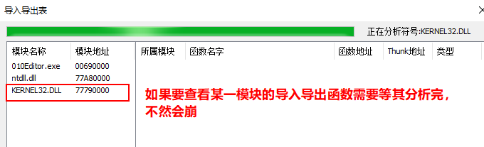

# README

## 前言

参照了Mr_Hock的调试器项目，如有错误，烦请不吝赐教

## 界面


## 功能介绍

#### 创建调试进程

​	使用`CFileDialog`类创建选择框

​	使用`CreateProcess`函数创建调试进程，第五个参数设置为以调试的方式启动即可`DEBUG_ONLY_THIS_PROCESS` | `CREATE_NEW_CONSOLE`


#### 附加进程

​	使用自定义消息向主窗口发送要附加的进程ID和路径

```c++
	//获取进程路径
	CString strPath = m_list.GetItemText(index, 2);
	//向主窗口发送进程ID
	::SendMessage(this->GetParent()->m_hWnd, WM_AttachProcessId, nPid, (LPARAM)strPath.GetBuffer());
	SendMessage(WM_CLOSE);
```

​	使用`DebugActiveProcess`根据接收到的ID附加进程

#### 查看，修改汇编，内存，栈，寄存器

​	反汇编引擎使用的是 `BeaEngine_4.1`,汇编引擎使用的是`XEDParse`

#### 查看模块，导入表导出表

​	要查模块的导入导出表需要等该模块分析完毕，不然会造成数组越界，程序崩溃



#### 支持软件/硬件/内存断点，支持条件断点

​	包括硬件读写访问，内存读写访问

#### 反反调试

​	处理了`PEB.BeginDebug`,`PEB.NtGlobalFlag`和`NtQueryInformationProcess`(DebugPort)

#### 关键代码高亮，断点高亮

​	call开头指令与j开头的指令

#### 解析符号

​	有点问题，代码在源码中放着，可以看看，能解决，烦请不吝赐教

#### 支持插件功能

```c++
//插件名
#define PLUGINNAME "XBhelloworld"

//初始化插件接口，必选！返回值为插件名字
CHAR* WINAPI InitPlugin()
{
	CHAR * nRet = PLUGINNAME;
	MessageBox(NULL, _T("插件已加载"), _T("Hello,XiaoBai"), NULL);
	return nRet;
}

//被调试程序触发进程创建事件被调用(两个参数，调试器会返回进程id和线程id)
VOID WINAPI CreateProcessEvent(DWORD m_Pid, DWORD m_Tid)
{

}

//触发线程程创建事件被调用
VOID WINAPI CreateThreadEvent(HANDLE nHandle, DWORD nThreadLocalBase)
{

}
```